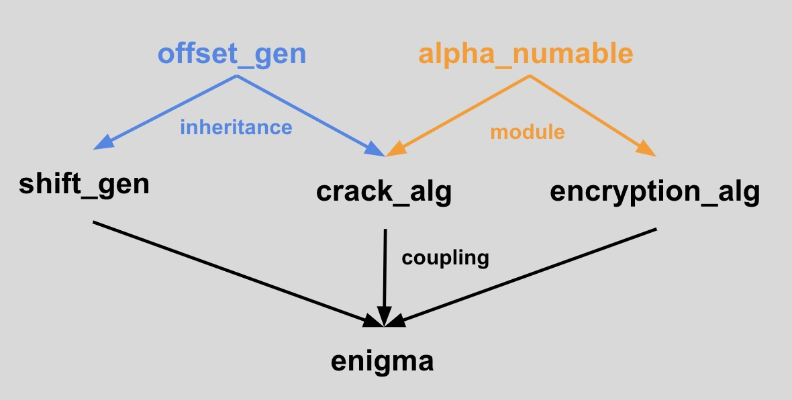

# Self Evaluation
## Ross Perry
## Enigma

## Functionality: 4
* Cracking, encryption, and decryption methods are functional
* Command Line Interface working as interaction pattern shows

## Object Oriented Programming (OOP): 3
* Inheritance, modules, and coupling were used to add functionality to various classes.
* I think `alpha_numable` is a great module. It doesn't contain much and is being used heavily in both `crack_algorithm` and `encryption_algorithm`.
* The `crack_algorithm` and `shift_gen` are children of the `offset_gen` as they both expand upon an offset generated from a date string.

  

## Ruby Conventions: 4
* I believe all classes and methods are well named
* All code is properly indented
* No methods are longer than 10 lines
* Enumerables used: `each, map, find, each_with_index, zip, rotate, loop,  include?, join, split, flatten, compact,  digits, reverse, sub`
* I am excited to defend any of my choices

## Test Driven Development: 3+
* Mocks and stubs are heavily used to generate random keys, dates, and CLI (see `enigma_test`)
* edge cases and methods that return many values are fully tested
* tests rely on coupled classes to pass all tests
* I'm excited to defend my use of stubs
* 99.5% passing. (how can I find those two lines of code?)

## Version Control: 4-/3+
* ~100 informative commits
* 12+ branches named appropriately
* Most commits are from small code changes, but there *has to be* at least 1 commit that has multiple pieces of functionality
